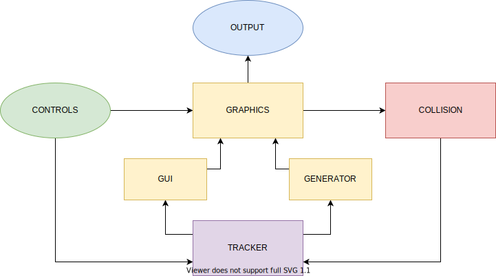
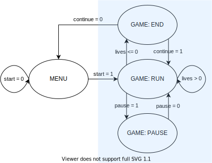
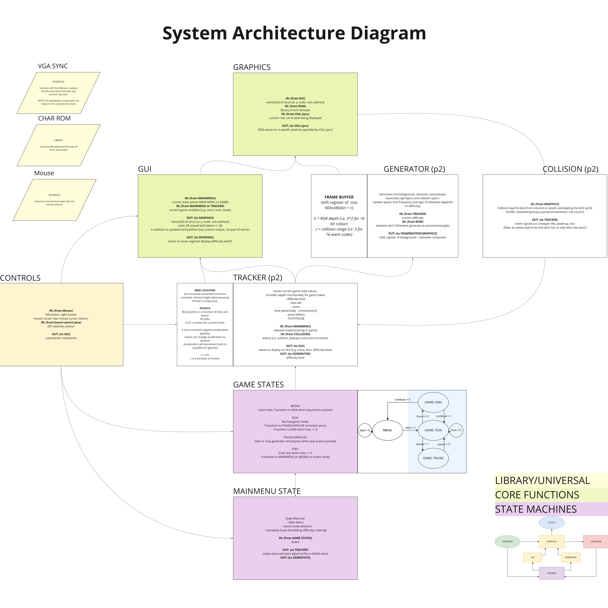

# CS305_VHDL_Project
8th April 2021

Team Minty: Callum McDowell, Louis Chuo, Daniel/Hao Lin

#### FLAP2LIV:
A flappy bird style game created for the Altera Cyclone III DE0 board. 
The game is controlled and played using a PS/2 mouse, DIP switches, and push-buttons available on the DE0 board. 
The game is displayed on a VGA screen with a resolution of 640 x 480 pixels.

Select a game mode from the main menu (TEST stays in lowest difficulty, GAME increases in difficulty), and press the arrow to start. 
Avoid the green pipe obstacles and pick up coloured squares to gain bonus effects. If your lives hit 0 the game ends. 
Try to get a new high score, displayed on the seven segment display!

See [course files](https://canvas.auckland.ac.nz/courses/60541/files/folder/MiniProject?) for further detail.

### Module Functionality Diagram:

### Simple Game Loop State Machine:

### Expanded Functionality of System

Generated with [app.diagrams.net](https://app.diagrams.net/) and [Miro](https://miro.com/app/)